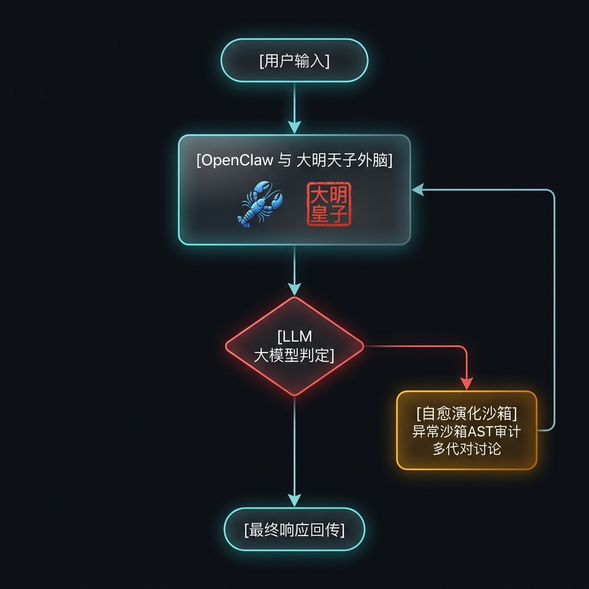

# Daming OS

<p align="center">
  
</p>

<p align="center">
  <b>A memory and growth system built for intelligent agents.</b>
</p>

<p align="center">
  <a href="README.md"></a>
  <a href="README.zh-CN.md"></a>
</p>

## About

Autonomous agents built on large language models face real operational risks when they run without a protective foundation—especially in high-privilege environments such as OpenClaw. Daming OS addresses three common failure modes:

> ### Key risks of unprotected agents
>
> - **Runaway cost:** ever-growing context windows can drive API spending sharply upward.
> - **Privilege escalation:** self-evolving code executed without auditing can expose an agent to attacks or unauthorized system changes.
> - **Error loops:** runtime failures or faulty logic can trap an agent in repeated self-correction and exhaust its API quota.

**Daming OS** is an industrial-grade memory and growth foundation for any agent runtime. It is not tied to OpenClaw or a particular agent framework: any host that implements the standard lifecycle, approval, and deployment contracts can integrate Codex, custom agents, LangGraph, and more.

## Daming OS Flow

The memory and growth systems are connected through an event bus and log channels, creating a closed feedback loop rather than operating in isolation.

<p align="center">
  
</p>

### Core capabilities

- **Three-tier semantic memory and search:** File locks and two-level caching deliver microsecond-scale hot-data responses, while dense vectors and sparse full-text retrieval provide multi-dimensional lookup.
- **Adaptive context gateway:** Cleans historical prompt tags before memory writes, retrieves context on demand, adapts history under quota pressure, and physically truncates output to prevent context overruns.
- **Secure sandbox and static safety gate:** Runs compile-level checks, static analysis, and smoke tests in isolation; blocks dangerous imports and filesystem reflection changes.
- **Exception capture and multi-agent self-healing:** Watches runtime errors, calculates growth scores with an exponentially decayed sliding window, and can trigger red/blue/white multi-agent deliberation to produce repair patches and practices.
- **Closed-loop reflection and atomic deployment:** Persists intercepted errors as negative-feedback memories, creates cold backups before deployment for safe rollback, and refreshes caches after release.
- **Universal lifecycle contract:** Records host events such as `turn`, `tool`, `model`, and `policy`, with tenant, agent, session, and trace identifiers for auditing and observability.
- **Memory governance:** Redacts sensitive credentials, enforces size limits and tenant/agent/session scopes, supports configurable retention, and rejects old unscoped data in tenant retrieval by default.
- **Recoverable evolution workflows:** Evolves through `proposed → validated → approved → deployed → verified/rolled_back`. Daming OS manages state and audit records; the host adapter explicitly supplies validation, approval, deployment, and rollback.
- **Production memory loop:** Appends hot memory for tool calls, state changes, and token use with file locks; creates progress snapshots after a window expires; clusters recurring failures into reviewable growth proposals.
- **Experience-to-skill pipeline:** Tracks experience through `pending → verified → deprecated` and only distills verified experience into human-reviewed skill candidates.
- **Quality gates:** High-risk tasks must pass an independent review; callers can query blockers before delivery or deployment.

## Integrate any agent

```python
from daming_os import AgentContext, DamingAdapter

adapter = DamingAdapter()
context = AgentContext(
    agent_id="research-agent",
    session_id="session-42",
    tenant_id="team-a",
    metadata={"trace_id": "trace-123"},
)
memories = adapter.before_turn("Retrieve the previous architecture decision", context)
# Run your host's model and tool calls here.
adapter.after_turn("Retrieve the previous architecture decision", "The architecture decision is…", context)
```

Use `EvolutionWorkflow` to inject your own `validator`, `approvals`, `deployer`, and `verifier`. This keeps chat platforms, webhooks, and deployment mechanisms out of Daming OS itself.

### Runtime and hook integration without OpenClaw

Independent runtimes bring the whitepaper's automatic recall/capture, lifecycle hooks, maintenance scheduling, two-tier semantic cache, context compression, and lazy skill loading directly into Daming OS. Any agent can pass its hook registry to `runtime.hooks.install`; long-running agents can explicitly enable the background scheduler.

```python
from daming_os import DamingRuntime

runtime = DamingRuntime("./.daming", skill_dirs=["./skills"])
runtime.hooks.install(agent.register_hook)  # Registers before_turn / after_turn / error.
runtime.start_scheduler(poll_seconds=30)  # Optional: only for a persistent host.
```

The `before_turn` hook payload uses `input`, `agent_id`, `session_id`, `tenant_id`, and optional `metadata.messages`; it returns `daming_memories`, `daming_compacted_messages`, and `daming_skill_context`. The host decides how to inject compacted history and skills. `after_turn` writes hot memory, publishes growth events, and calls `tick()` for due maintenance.

The default schedule is intentionally small:

- `daily-maintenance` at 02:30 runs deep-sleep consolidation, memory/agent health checks, and conditional approval reminders.
- `weekly-governance` runs Sunday at 23:30.
- `daily-digest` at 23:00 is opt-in with `runtime.daily_digest_enabled`; it replaces the former duplicate summary and diary outputs.
- `watchdog` is opt-in and checks only stale sessions. Neither it nor the daily digest is required for core memory.

Approval reminders are also checked after turns, run only when an approval is overdue, and have a 24-hour cooldown. Detailed agent-quality reports are persisted only when an anomaly is detected.

For semantic vector retrieval, provide any OpenAI-compatible embedding endpoint:

```python
from daming_os import OpenAICompatibleEmbeddingProvider
from daming_os.memory.core import MemorySystem

embeddings = OpenAICompatibleEmbeddingProvider(
    model="your-embedding-model", base_url="https://your-endpoint/v1"
)
memory = MemorySystem(embedding_provider=embeddings)
```

---

## One-command installation

The core plugin has no third-party runtime dependencies. Install it and generate a universal bridge inside the agent project:

```bash
pip install "daming-os @ git+https://github.com/dylanma8232-art/Daming-OS-openclaw.git"
daming-os install --host-dir .
```

The installer creates `daming_bootstrap.py`, isolated `.daming/` state, a stable host-specific Agent ID, and a protective `.daming/.gitignore`. It then runs a real isolated capture → consolidation → recall smoke test. Host-owned instruction and secret files remain untouched, and re-running the installer safely upgrades Daming-generated files.

Use the generated facade directly, or register all three lifecycle hooks at once:

```python
from daming_bootstrap import daming

session_id = daming.new_session_id()
context = daming.before_turn("hello", session_id=session_id)
# Run the host model/tools, optionally injecting context["daming_memories"].
daming.after_turn("hello", "done", session_id=session_id)

# Hosts exposing register(name, callback) can install all hooks in one call.
daming.install_hooks(agent.register_hook)
```

The generated bridge initializes lazily and is fail-open by default: a Daming storage/configuration failure is reported through `daming_degraded` without taking down the host Agent. Use `DamingPlugin(strict=True)` when the host requires fail-closed behavior.

Local growth approvals require no chat platform:

```bash
daming-os approvals --dir ./.daming list
daming-os approvals --dir ./.daming issue <proposal-id>
daming-os approvals --dir ./.daming approve <proposal-id> <otp>
```

The OTP is displayed once and never written to Daming logs. Workspace schema migrations are versioned, backed up, and applied automatically; they can also be run explicitly with `daming-os migrate --dir ./.daming`.

Optional capabilities remain explicit: install `[vector]`, `[llm]`, or `[full]` only when needed. Diagnose or inspect an installation with `daming-os doctor --dir ./.daming` and `daming-os status --dir ./.daming`. Missed daily/weekly work catches up on the next turn, while failures retry with bounded exponential backoff.

---

## Security statement

Daming OS follows a defense-first approach. Its security gate blocks advanced privilege-escalation patterns and filesystem reflection changes by default. If an agent genuinely needs high-privilege system access, grant it explicitly through policy configuration or carefully tailor the safety allowlist.
